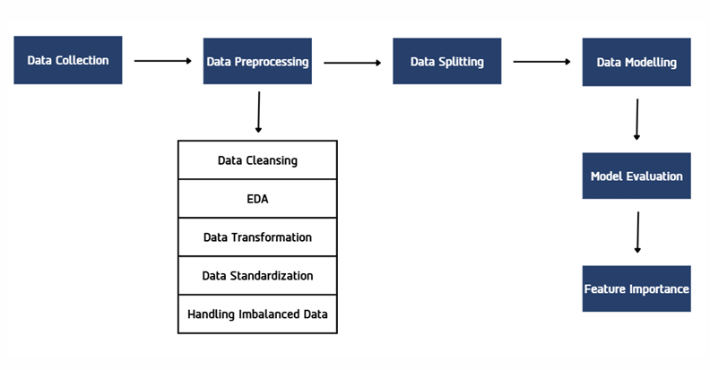

# Customer-Churn-Prediction-Project

This project presents a comparative study of machine learning algorithms for **predicting customer churn** in the telecommunications industry. Using a real-world dataset of 7,043 customers, the project evaluates how different classification algorithms and imbalanced-data handling techniques affect prediction performance, with the goal of helping businesses proactively retain at-risk customers.

*This project was originally developed as a Final-Year Project (Senior Thesis) for the Bachelor of Science in Computer Science, Faculty of Science and Technology, Thammasat University (2024).*

## 📖 Project Overview

This project involves:

1. **Data Preprocessing**: Cleaning, transforming, and standardizing the Telco Customer Churn dataset.
2. **Handling Imbalanced Data**: Comparing three techniques — Random Undersampling, Random Oversampling, and SMOTE — to address the class imbalance between churned and retained customers.
3. **Model Building**: Training and comparing three classification algorithms — **Random Forest**, **XGBoost**, and **SVM**.
4. **Model Evaluation**: Assessing performance using Accuracy, Precision, Recall, Confusion Matrix, and ROC-AUC.
5. **Feature Importance Analysis**: Identifying which customer attributes most strongly influence churn behavior.

---

## 🏗️ Methodology

The research workflow follows six main stages:

1. **Data Collection**: Telco Customer Churn dataset (7,043 customers, 21 features) sourced from Kaggle.
2. **Data Preprocessing**: Removing irrelevant fields, handling missing values (11 rows with null `TotalCharges` removed), encoding categorical variables via One-Hot Encoding, and standardizing numeric features.
3. **Handling Imbalanced Data**: Applying Random Undersampling, Random Oversampling, and SMOTE to correct the ~73% / ~27% class imbalance between retained and churned customers.
4. **Data Splitting**: 70% training / 30% testing split, applied consistently across all four dataset versions (original + 3 balancing techniques).
5. **Model Building**: Training Random Forest, XGBoost, and SVM on each dataset version.
6. **Model Evaluation & Feature Importance**: Comparing results across all 12 model/technique combinations and identifying key churn drivers.

---

## 📊 Key Results & Insights

### **Best Performing Model**
The **Random Forest** model combined with **Random Oversampling** achieved the best overall results:

| Metric | Score |
|---|---|
| Accuracy | 88.77% |
| Precision | 84.83% |
| Recall | 94.54% |
| AUC | 0.95 |

### **Key Findings**
- **Class imbalance matters**: Without handling imbalanced data, all three algorithms achieved high accuracy (~79%) but poor Recall (47–50%) — meaning they frequently failed to catch customers who actually churned.
- **Oversampling techniques (Random Oversampling & SMOTE) significantly improved Recall**, making models far more useful for real-world retention strategies, at a modest cost to raw accuracy.
- **Undersampling improved class balance but hurt accuracy** due to the loss of training data, making it the least suitable technique for this dataset.
- **Top churn drivers** (via Feature Importance): **Total Charges**, **Tenure**, and **Monthly Charges** — customers with shorter tenure and specific billing patterns are most likely to churn.

### **Business Recommendation**
For imbalanced churn datasets where the minority (churn) class is business-critical, **Random Oversampling** offers the best trade-off between catching at-risk customers (high Recall) and overall model reliability — making it the recommended approach for this use case.

---

## 🧠 Algorithms Compared

- **Random Forest** — Ensemble of decision trees using majority voting.
- **XGBoost** — Gradient-boosted decision trees that iteratively correct prior errors.
- **SVM (Support Vector Machine)** — Finds the optimal hyperplane to separate churned vs. retained customers.

## ⚖️ Imbalanced Data Techniques Compared

- **Random Undersampling** — Reduces the majority class to match the minority class.
- **Random Oversampling** — Duplicates minority class samples to match the majority class.
- **SMOTE** — Generates synthetic minority class samples using K-Nearest Neighbors.

---

## 🛠️ Tech Stack

- **Language**: Python
- **Libraries**: Pandas, Scikit-learn, XGBoost, Matplotlib/Seaborn
- **Techniques**: EDA, Standard Scaling, One-Hot Encoding, SMOTE, Random Forest, XGBoost, SVM, ROC-AUC Analysis
